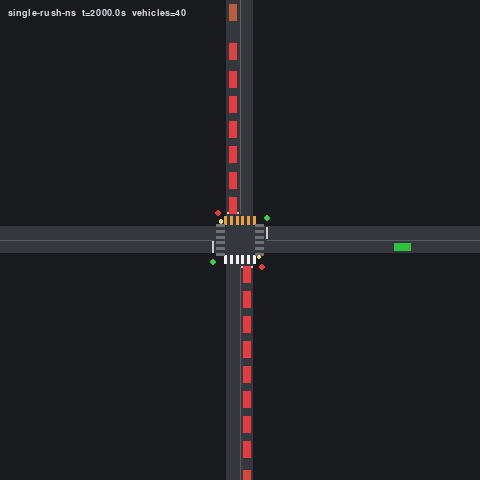
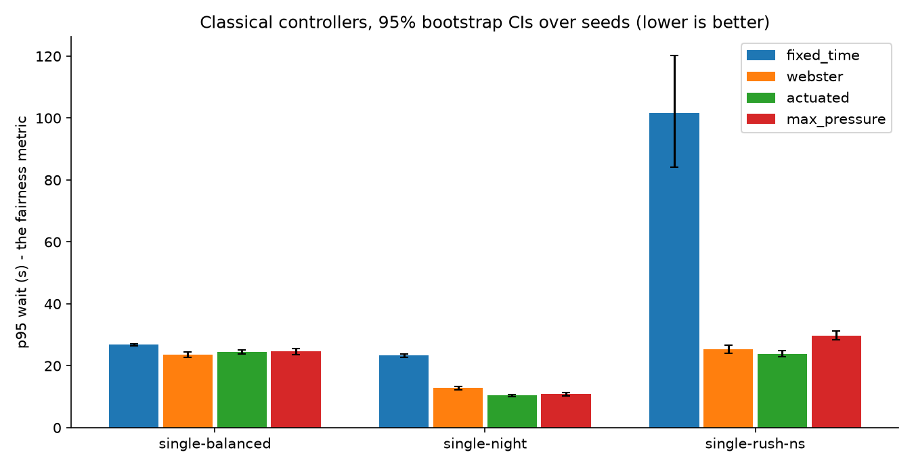

# traffic-rl

What's the best red/green schedule for traffic lights — minimum total waiting, kept
realistic? From Webster's 1958 formula to multi-agent RL on one question.



Five phases, each one publishable step up the reality ladder:

1. **World + honest floor** — custom 2D simulator (cars, pedestrians, physics-correct
   signals) and the classical baselines: fixed-time, Webster, actuated, max-pressure.
2. **Omniscient RL** — DQN/PPO on one intersection, then a 3×3 grid. Does a green wave
   emerge, or must it be encoded?
3. **Partial observability** — real sensors miss cars. Where does RL's edge evaporate?
4. **Humans** — heterogeneous drivers and pedestrians, jaywalking, red-light running,
   stalls. Robustness and safety, not just speed.
5. **Beyond the grid** — corridors, T-junctions, roundabouts. Does the policy transfer?

Every controller — classical or trained — drives the same sim through one interface, in
two modes: headless (training/eval, seeded, CIs) and a live 2D viewer with GIF export.
Baselines are the honesty layer: RL that can't beat max-pressure ships as a negative
result, not hidden.

## Status: phase 1 — the world and the honest floor

The simulator and all four classical controllers are live. Headline results
([full leaderboard](docs/leaderboard.md), 20 seeds per cell, 95% bootstrap CIs):

- **Rush (NS-heavy):** naive 50/50 fixed-time posts a p95 wait of **102 s
  [85, 121]** — the widest CI on the board; instability under asymmetric load is
  itself the result. Webster (tuned from the sim's own measured saturation flow),
  gap-out actuated, and max-pressure all land at **24–30 s**.
- **Night:** actuated dominates (p95 wait 11.7 s vs fixed-time's 25.2 s) — and
  max-pressure's pedestrian-blindness becomes visible (p95 ped wait 70 s, bounded
  only by the signal machine's starvation cap, exactly as designed).
- Throughput is identical everywhere (unsaturated); anyone selling a throughput win
  here would be selling noise. p95 wait is the fairness metric: means hide starvation.



What "physics-correct" means here (locked in
[ADR 0002](docs/decisions/0002-metrics-and-realism-constraints.md) before any code):
ITE kinematic yellow, all-red clearance from geometry, MUTCD pedestrian WALK +
clearance interlocks, a 120 s max-red starvation cap the controller cannot override,
and metrics whose trip clock starts at the demand event so boundary queueing can't
be gamed. Controllers see detection-level Observations (per-approach detected
vehicles, stop-line loop occupancy, flows), never the world state — that seam is
where phase 3's noisy sensors drop in.

### Quickstart

```bash
uv sync
uv run traffic-rl run scenarios/single-rush-ns.yaml --seed 42     # headless + metrics
uv run traffic-rl view scenarios/single-rush-ns.yaml --seed 42    # live 2D viewer
uv run traffic-rl run scenarios/single-balanced.yaml --record runs/t.npz
uv run traffic-rl gif runs/t.npz out.gif --start 600 --end 720    # replay -> GIF
uv run traffic-rl calibrate                                       # measured sat flow
uv run traffic-rl leaderboard                                     # the full matrix
uv run traffic-rl bench                                           # kernel throughput
```

Sim core: NumPy structure-of-arrays over CSR lane segments, IDM car-following,
ballistic integration with exact-stop correction, dt = 0.1 s — ~800x realtime for
the vehicle kernel at 1k vehicles (synthetic bench, one CPU core), and the same
layout batches many worlds in phase 2.

### Docs

- [docs/map.md](docs/map.md) — the codebase map: what every folder and file does.
- [docs/experiments.md](docs/experiments.md) — every command, its outputs, and which
  phase it is current with.
- [docs/results/phase-1.md](docs/results/phase-1.md) — what the phase-1 experiments
  actually showed, beyond the tables.
- [docs/decisions/](docs/decisions/) — ADRs; 0002 is the locked metrics spec.
